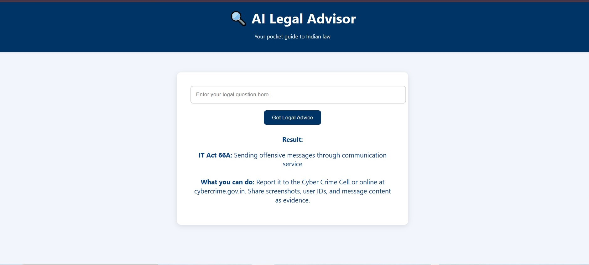

# ⚖️ AI Legal Advisor

A pocket-friendly legal assistant web app that helps users understand legal procedures in simple terms.  
It matches user queries with predefined legal sections and gives helpful legal actions based on keywords.

---
## 🧰 Tech Stack

- `Python`
- `Flask`
- `HTML/CSS`
- `JavaScript` (if you add any interactivity)
- `Git & GitHub`

## Screenshot

